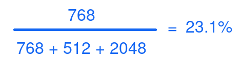
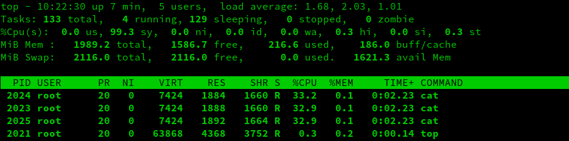
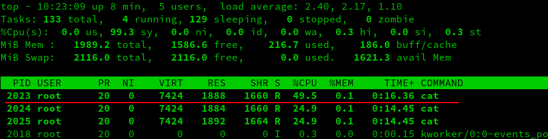
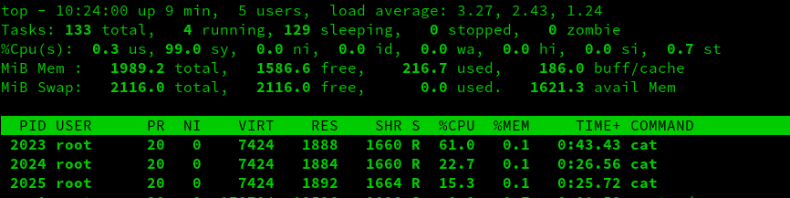
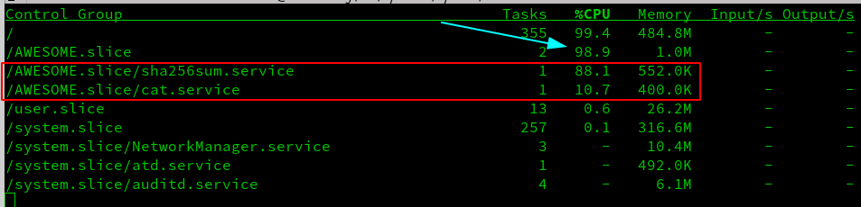
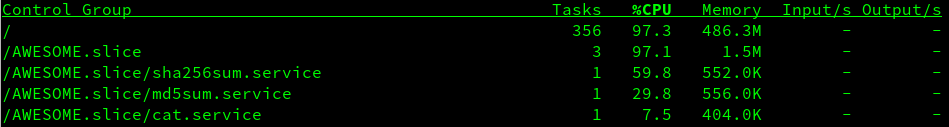

# Introduction
So you've heard of this thing called CGroups and you are interested to find out more. Perhaps you caught mention of it while listening to a talk about containerization. Maybe you were looking into Linux performance tuning, or maybe you just happened to be traversing your file system one day and discovered `/sys/fs/cgroups`. Either way, you want to learn a bit more about his functionality that has been baked into the kernel for quite some time. So sit back, grab some popcorn and prepare to (hopefully) learn something you may not have known before.

## What Are CGroups

Webster's dictionary defines CGroups as... Just kidding, I always hated listening to talks that started with, or otherwise sourced boring dictionary definitions. Instead I am going to attempt to distil the technical definition down into something easy to understand.

As you may or may not know, the Linux kernel is responsible for all of the hardware interacting reliably on a system. That means, aside from just the bits of code (drivers) which enable the operating system (OS) to understand the hardware, it also is able to set limits on how much a particular program can demand from system resources. This is most easily understood when talking about the amount of memory (ram) a system has to divide up amongst all of the applications your computer may execute. In its' most basic form, a Linux system is allowed to run most applications without restriction. This can be great for general computing if all applications play nicely together. But what happens if there is a bug in a program and it starts to consume all of the available memory? The kernel has a facility called the Out Of Memory (OOM) Killer whose job is to stop applications in order to free up enough RAM that the OS may continue to function without crashing.

That's great you say, but what does this have to do with CGroups? Well, the OOM process acts as a last line of defense before your system comes crashing down around you. It's useful to a point, but since the kernel can control which processes must survive the OOM, it can also determine which applications cannot consume too much RAM in the first place.

CGroups are therefore, a facility built into the kernel which allow the administrator to set resource utilization limits on any process on their system. In general, CGroups can control:
* The number of CPU shares per process
* The limits on memory per process
* Block Device I/O per process
* which network packets are identified as the same type so that another application can be used to enforce network traffic rules.

There are more facets than just these, but those are the major categories that most administrators care about.

## CGroup Humble Beginning

Control groups (cgroups) are a Linux kernel mechanism for fine-grained control of resources. Originally put forward by Google engineers in 2006, CGroups were eventually merged into the Linux kernel around 2007.  While there are currently 2 versions of CGroups, most distributions and mechanisms use version 1 as it has been in the kernel since 2.6.24. As with most things that are adopted into the mainline kernel, there was not a huge adoption rate at first. Version 2 continues this trend, having been around for almost half a decade but still not widely deployed.

Part of the thing that plagues CGroup adoption is simply the widespread knowledge of its existence and the part that it plays on the modern Linux system. Low awareness and adoption often means that the interaction with a kernel interface is clunky, convoluted or just down right a manual process. Such was the case with CGroups initially. Sure it's not that hard to create one-off CGroups. For example, if you wanted to simulate the early days before the tooling around CGroups were developed you could create a bunch of directories, mount the `cgroup` filesystem and start configuring everything by hand. But before we get to all that, let's talk a little bit about *why* CGroups are vital in today's Linux ecosystem.

## Why CGroups Are Important

CGroups have 4 main features that are closely related to each other that make them very important in a modern system, especially if you are running a containerized workload.

1. Resource Limiting
As touched upon earlier, CGroups allow an administrator to ensure that programs running on their system stay within certain acceptable boundaries for things like CPU, RAM, Block device I/O and Device groups.

> This last feature about device groups, can feature in a comprehensive security strategy for your system. Device groups include controlling permissions for `read`, `write` and `mknod` operations. The read/write operations are fairly self explanatory, so let's take a moment to look at the `mknod` functionality in a Linux system.
>
>`mknod` was initially designed to populate all of the things that show up in `/dev/` these are things like hard drives, USB interfaces for devices like the Arduino or other devices that might exist on a system. Most systems use `udev` to automatically populate this virtual filesystem with things detected by the kernel. It can also be used to allow multiple programs to communicate with each other by creating a `named pipe`. This concept is beyond the scope of this explanation, but it is sufficient to understand that this can be used to facilitate passing information from one program to another. Regardless, the `mknod` in a controlled environment, is something that an administrator should look closely at restricting.
{.is-info}


2. Prioritization
This is slightly different than resource limiting because you are not restricting processes necessarily. Instead you are simply saying that regardless of how many resources are available process X will always have more time on the system than process Y.

3. Accounting
While accounting is turned off by default for most enterprise versions of Linux due to additional resource utilization, it can be really helpful to turn on resource utilization for a particular tree (More on this later). You can thus see what processes inside of which CGroup are consuming which types or resources.

4. Process Control
There is a facility in CGroups called `freezer`. While a deep understanding of this functionality is outside the scope of this article, you can think of `freezer` as the ability to take a `snapshot` of a particular process and move it. See the [Kernel Documentation](https://www.kernel.org/doc/html/latest/admin-guide/cgroup-v1/freezer-subsystem.html) for a deeper understanding.

Ok, so what does this all mean? Well from a system administrators' perspective it means several things.

First, even without delving into container technology, it means that you can achieve greater density on a single server by carefully managing the type of work load, the applications and the resources that they require.

Second, it enhances your security posture quite a bit. While a normal Linux installation makes use of CGroups by default, they do not put any restrictions upon processes. You could impose restrictions by default if you so chose. In addition, you can restrict access to specific devices for specific users, groups or processes and this further helps to lock down a system.

Finally, you can do a significant amount of performance tuning through CGroups. That in combination with [tuned](https://access.redhat.com/documentation/en-us/red_hat_enterprise_linux/7/html/power_management_guide/tuned) means that you can create an environment specifically adjusted for your individual work loads. At scale, or in a latency sensitive environment, these adjustments can mean the difference between meeting or missing your Service Level Agreements (SLAs).


## How Do CGroups Work?

For the purposes of this discussion we will be talking about **CGroups V1**. While version 2 is available in Red Hat Enterprise Linux 8 (RHEL 8), it is disabled by default. Most of the container technologies such as Kubernetes, OpenShift, Docker and so on still rely on CGroups version 1

At a very high level we have already discussed that CGroups are a mechanism for controlling certain subsystems in the kernel. These subsystems, such as devices, cpu/ram/network access and so on, are called controllers in the CGroup terminology.

Each type of controller, (cpu, blkio, memory etc) are subdivided into a tree-like structure. Each branch or leaf can have it's own weights or limits. A control group can have multiple processes associated with them making resource utilization granular and easy to fine-tune.

> **NOTE**: Each child inherits and is restricted by the limits set on the parent CGroup.
{.is-info}


In the diagram above, you can see that it is possible to have `pid 1` in memory, disk i/o and cpu control groups. The CGroups are created per resource type and have no association with each other. That means you could have a `database` group associated with all of the controllers but the groups are treated as independent groups. These groups, similar to GIDs, are assigned a numeric value upon creation and under the hood, the kernel uses these values to determine resource allocation and not a friendly name. To think of it another way, assume that each CGroup name, once attached to a controller, is renamed to the name of the controller + the name of your choosing. So a group called `database` in the `memory` controller can actually be thought to be `memory-database`. Thus, there is no relation to a `database` group associated with the controller `cpu` as the friendly name can be thought of as `cpu-database`.

> **IMPORTANT NOTE:** This is a gross simplification and is NOT technically accurate should you be looking to get involved with the underlying CGroup code. The above explanation is meant for _clarity of understanding_.
{.is-warning}


This article is not meant to be a breakdown of all the controller types that exist in CGroups. Something on that scale would take an entire book to explain properly. Instead, we are going to look at CPUShares due to their relative complexity and the importance which they play in the overall health of a system. However, the other controllers function in a similar fashion and therefore you should be able to take the lessons learned from the CPU controller and apply it to most of the remaining CGroup controllers. 

## A Deeper Look At CPUShares

### A Little About CPU Schedulers

I'm going to take a very narrow focus on RHEL for this section, although in my quick look at the few Ubuntu boxes I have in my lab I have noticed similarities with the I/O scheduler and therefore could be applicable to other distributions as well. Most of the Red Hat family of products (Fedora, CentOS and RHEL) use either `deadline` or `cfq` as the  default schedulers.

**CFQ:** or the Completely Fair Queuing, puts an emphasis on I/O coming from real time processes and uses historical data to decide whether an application will issue more I/O requests in the near future.

**Deadline:** attempts to provide a guaranteed latency for requests and is particularly suitable when read operations occur more often than write operations. There is one queue for reads and one for writes. Operations are completed based on time spent in queue and the kernel will always try to process requests before their maximum amount of time has elapsed. Read operations take precedence over write batches by default.

With that in mind, RHEL tends to use `CFQ` for SATA based drives and `deadline` for all other cases by default. This can play an important role in tuning your system. These schedulers can be changed of course, and you should investigate your work load and pick the scheduler that best suits your task(s). It is also worth noting that a scheduler can be chosen _per block device_. This means that you could have multiple schedulers on a single system depending on how you have configured your disks.

This little bit of background information can be an important distinction for the veteren administrator, particularly coming from a different operating system. CPUs under these schedulers are not measured so much in processor counts, but rather as time slices on the system as a whole.

### CPUShares

CPU shares provide tasks in a cgroup with a relative amount of CPU time. Once the system has mounted the `cpu` cgroup controller, you can use the file `cpu.shares` to define the number of shares allocated to the cgroup. CPU time is determined by dividing the CGroup's CPUShares by the total number of defined CPUShares on the system. This CPU time math can get quite complicated so let's take a look at some diagrams to help clarify things.


The above diagram represents some of the most common elements on a RHEL 7 OpenShift Container Platform control plane server. Every process on this system starts with the `/` CGroup. All of these.

In RHEL, this begins with the root `/` cgroup with 1024 shares and 100% of CPU resources. The rest of the resources are divided equally amongst the groups `/system.slice`, `/user.slice`, and `/kubepod.slice` each with an equal weight of 1024 by default as seen below:


In this scenario the logic is pretty straight forward: each slice can use only 33% of the CPUShares in the event that all CGroups are demanding shares at the same time. The math is pretty simple:


And when you plug in the numbers:


However, what if you decided to nest groups, or change the weight of groups at the same level? Below is an example of the nested groups:


In this example you can see that I have created a CGroup for different users. Here is where the math gets interesting. At first you would think that the following equation would work just fine:



However, this is only 23% of the 33% alloted to the `user.slice`. That means, user 1 has a total of approximately 7.6% of total CPU time based on these weights in the event of resource contention.

CPUShares just got complicated in a hurry! Thankfully, most of the other controllers are more straight forward than that.


## Doing CGroups The Hard Way

Let's take a look at how to create CGroups without any of the tooling around them. At their heart, CGroups are simply a directory structure with `cgroups` mounted into them. They can be located anywhere on the filesystem, but by default you will find the system-created CGroups in `/sys/fs/cgroup`. So how do you create CGroups? Start off by creating the top level directory:

```
mkdir -p /my_cgroups
```

After this is created, decide which controllers you wish to use. Remember that the structure for CGroups version 1 looks something like this

```
/my_cgroups
├── <controller type>
│   ├── <group 1>
│   ├── <group 2>
│   ├── <group 3>
```

All groups you wish to create are nested separately under each controller type. Therefore `group1` under the controller `memory` is completely independent from `group1` in `blkio`. With that in mind, let's create a basic CPUShares example.

For ease of simplicity, we are going to generate load on the system by running
```
cat /dev/urandom
```
This will put some artificial load on the system for easy measuring. This will not be a real-world load example but it will highlight the main points of CPUShares. In addition, I have setup a virtual machine running CentOS 8 with a single vCPU in order to make the math really simple. With that in mind, our first step is to create some directories for our CGroup controllers:

```
mkdir -p /my_cgroups/{memory,cpusets,cpu}
```

Next we mount the CGroups into these folders:
```
mount -t cgroup -o memory none /my_cgroups/memory
mount -t cgroup -o cpu,cpuacct none /my_cgroups/cpu
mount -t cgroup -o cpuset none /my_cgroups/cpuset
```

In order to create our own CGroups, we simply create a new directory under the controller we want to utilize. In this case we are going to be dealing with the file `cpu.shares` which is found in the `cpu` directory. So let's create a couple of CGroups under the `cpu` controller:

```
mkdir -p /my_cgroups/cpu/{user1,user2,user3}
```

You will notice that the directories will be automatically populated by the controller:

```
ls -l /my_cgroup/cpu/user1/
-rw-r--r--. 1 root root 0 Sep  5 10:26 cgroup.clone_children
-rw-r--r--. 1 root root 0 Sep  5 10:26 cgroup.procs
-r--r--r--. 1 root root 0 Sep  5 10:26 cpuacct.stat
-rw-r--r--. 1 root root 0 Sep  5 10:26 cpuacct.usage
-r--r--r--. 1 root root 0 Sep  5 10:26 cpuacct.usage_all
-r--r--r--. 1 root root 0 Sep  5 10:26 cpuacct.usage_percpu
-r--r--r--. 1 root root 0 Sep  5 10:26 cpuacct.usage_percpu_sys
-r--r--r--. 1 root root 0 Sep  5 10:26 cpuacct.usage_percpu_user
-r--r--r--. 1 root root 0 Sep  5 10:26 cpuacct.usage_sys
-r--r--r--. 1 root root 0 Sep  5 10:26 cpuacct.usage_user
-rw-r--r--. 1 root root 0 Sep  5 10:26 cpu.cfs_period_us
-rw-r--r--. 1 root root 0 Sep  5 10:26 cpu.cfs_quota_us
-rw-r--r--. 1 root root 0 Sep  5 10:26 cpu.rt_period_us
-rw-r--r--. 1 root root 0 Sep  5 10:26 cpu.rt_runtime_us
-rw-r--r--. 1 root root 0 Sep  5 10:20 cpu.shares
-r--r--r--. 1 root root 0 Sep  5 10:26 cpu.stat
-rw-r--r--. 1 root root 0 Sep  5 10:26 notify_on_release
-rw-r--r--. 1 root root 0 Sep  5 10:23 tasks
```

Now that we have some CGroups setup, it's time to generate some load. For this, I simply opened up 3 SSH sessions and ran the following command in the foreground:
```
cat /dev/urandom
```
You can see the results in `top`:


> **IMPORTANT NOTE:** Remember that the CPUShares are based off the top level CGroup which is unconstrained by default. This means that should a process higher up in the tree demand CPUShares, the system will give that process priority. This can confuse people. It's very important to have a visual representation of the CGroup layout on a system to avoid confusion.
{.is-warning}


In the screenshot above you can see that all of the cat processes are receiving more or less the same amount of CPU time. This is because, by default CGroups are given a value 1024 in `cpu.shares`. These shares are constrained by the parent's relationship to other CGroups as discussed earlier. In our example, I have not adjusted the weight of any of the parents and therefore if all parent CGroups are demanding resources at the same time, the default weighting of 1024 CPUShares applies.

Getting back to our example, we have created a CGroup with some default values. That means that each group will have the default weighting of 1024. To change this, you can simply change the values in the `cpu.shares` file:

```
echo 2048 > user1/cpu.shares
echo 768 > user2/cpu.shares
echo 512 > user3/cpu.shares
```
Excellent, we now have a more complicated weighting calculation, but we have not actually added any processes to the CGroup. Therefore, our CGroup is inactive. To add a process to a CGroup, simply add the desired PID to the `tasks` file:

```
echo 2023 > user1/tasks
```

Here is the result of adding a process into a CGroup as seen in `top`:



As you can see in the screenshot above, the process in our new CGroup is receiving roughly half of the CPU time. This is because of the equation from earlier:


Let's go ahead and add the other two processes into their respective CGroups and observe the results:
```
echo 2024 > user2/tasks
echo 2025 > user3/tasks
```



We can now see that the weighting has taken affect with the CGroup `user1` taking up about 61% of the CPU time:


The remaining time is split between `user2` and `user3`.

There are of course, several problems with our test setup.
1. These are all created by hand. What happens if the process you are putting into a CGroup changes its PID?
2. The custom files and folders created will not survive a reboot
3. This is a lot of manual work! Where is the tooling?

Have no fear my friends, `systemd` has you covered!

## CGroups With Systemd

By default, systemd creates a new cgroup under the system.slice for each service it monitors. Going back to our OpenShift Control Plane host, running `systemd-cgls` shows the following services under the `system.slice` (output has been truncated for brevity):

```
└─system.slice
  ├─sssd.service
  ├─lvm2-lvmetad.service
  ├─rsyslog.service
  ├─systemd-udevd.service
  ├─systemd-logind.service
  ├─systemd-journald.service
  ├─crond.service
  ├─origin-node.service
  ├─docker.service
  ├─dnsmasq.service
  ├─tuned.service
  ├─sshd.service
  ├─NetworkManager.service
  ├─dbus.service
  ├─polkit.service
  ├─chronyd.service
  ├─auditd.service
    └─getty@tty1.service
```

You can change this behaviour by editing the systemd service file. There are three options with regards to CGroup management with systemd.
1. Editing the service file itself
2. Use drop in files
3. Using `systemctl set-property` commands which are the same as manually editing the files but `systemctl` creates the required entries for you


### Editing Service Files
Let's edit the unit file itself. To do this I created a very simple unit file which runs a script:

```
[Service]
Type=oneshot
ExecStart=/root/generate_load.sh
TimeoutSec=0
StandardOutput=tty
RemainAfterExit=yes

[Install]
WantedBy=multi-user.target
```

The bash script has only 2 lines:
```
#!/bin/bash
/usr/bin/cat /dev/urandom > /dev/null &
```

When we examine the output of `systemd-cgls` we can see that our new service is nested under the `system.slice` (output truncated):

```
└─system.slice
  ├─cat.service
  ├─tuned.service
  ├─sshd.service
  ├─NetworkManager.service
  ├─sssd.service
  ├─dbus.service
  │ └─getty@tty1.service
  └─systemd-logind.service
```

What happens if we add the following line to the `systemd` service file?
```
Slice=my-beautiful-slice.slice
```

The output of `systemd-cgls` shows something curious. Our `cat.service` file is now deeply nested:

```
Control group /:
├─my.slice
│ └─my-beautiful.slice
│   └─my-beautiful-slice.slice
│     └─cat.service
│       └─4010 /usr/bin/cat /dev/urandom
```

Why is this? The answer has to do with the way that `systemd` interprets nested CGroups. Children are declared in the following fashion `<parent>-<child>.slice`. Since `systemd` is attempting to be helpful, if a parent does not exist, `systemd` will create it for you. If we had have used underscores `_` instead of dashes `-` the result would have been what you would have expected:

```
Control group /:
├─my_beautiful_slice.slice
│ └─cat.service
│   └─4123 /usr/bin/cat /dev/urandom
```

### Using Drop-in Files

Drop-in files for `systemd` are fairly trivial to set up. Start by making an appropriate directory based on the name of your service in `/etc/systemd/system`. In our `cat` example you would run the following command:

```
mkdir -p /etc/systemd/system/cat.service.d/
```

These files can be organized anyway you like them. They are actioned based on numerical order so you should name your configuration files something like `10-CPUSettings.conf`. All files in this directory should have the file extension `.conf` and require you to run `systemctl daemon-reload` every time you make an adjustment to one of these files.

I have created 2 drop-in files to show how you can split out different configurations. The first is `00-slice.conf` and as seen below, sets up the default options for a separate slice for the `cat` service:

```
[Service]
Slice=AWESOME.slice
MemoryAccounting=yes
CPUAccounting=yes
```

The other file sets the number of CPUshares and it's called `10-CPUSettings.conf`

```
[Service]
CPUShares=256
```

To show that this method works, we are going to create a second service in the same slice. To make it easier to tell the processes apart the second script is slightly different:

```
#!/bin/bash
/usr/bin/sha256sum /dev/urandom > /dev/null &
```

I then simply created copies of the `cat` files replacing the script and changing the CPUShares value:

```
sed 's/load\.sh/load2\.sh/g' cat.service > sha256sum.service
cp -r cat.service.d sha256sum.service.d
sed -i 's/256/2048/g' sha256sum.service.d/10-CPUSettings.conf
```

Finally, reload the daemon and start the services:

```
systemctl daemon-reload
systemctl start cat.service
systemctl start sha256sum.service
```

Instead of showing you the output from `top`, now would be a good time to introduce you to `systemd-cgtop`. It works in a similar fashion to regular `top` except it gives you a breakdown per slice, and then again by services in each slice. This can be very helpful in determining whether you are making good use of CGroups in general on your system. As seen below, `systemd-cgtop` shows both the aggregation for all services in a particular slice as part of the overall system, but also the resource utilization of each service in a slice:



### `systemctl set-property`

The last method that can be used to configure CGroups is the `systemctl set-property` command. We'll start with a basic service file `md5sum.service`:

```
[Service]
Type=oneshot
ExecStart=/root/generate_load3.sh
TimeoutSec=0
StandardOutput=tty
RemainAfterExit=yes
Slice=AWESOME.slice

[Install]
WantedBy=multi-user.target
```

> using the `systemctl set-property` command places the files in `/etc/systemd/system.control` these files are not to be edited by hand.
>
> Not every property is recognized by the `set-property` command so the `Slice` definition was put in the service file itself.
{.is-info}

After we have setup the unit file and reloaded the daemon, you can use the `systemctl` command similar to the following:

```
systemctl set-property md5sum.service CPUShares=1024
```

This will create a drop in file for you located at `/etc/systemd/system.control/md5sum.service.d/50-CPUShares.conf`. Feel free to look at the files if you are curious as to their contents. As these files are not meant to be edited by hand, we aren't going to spend any time on them.

You can test to see if the changes have taken affect by running
```
systemctl start md5sum.service cat.service sha256sum.service

```

As you can see from the screenshot below, the changes appear to be successful. `sha256sum.service` is configured for 2048 CPUShares, while `md5sum.service` has 1024 and finally `cat.service` has 256.




# Wrap Up

Hopefully you learned something new throughout our journey together. There was a lot to tackle and we barely even scratched the surface on what is possible with CGroups. Aside from the role that CGroups can play in keeping your system healthy, it can also play a part in a 'defense in depth' strategy. Further to this, CGroups are a critical component for modern Kubernetes work loads where they aid in the proper running of containerized processes. CGroups are responsible for so many things including:
* limiting resources of processes
* deciding priorities when contentions do arise
* controlling access to read/write and mknod devices
* providing a high level of accounting for processes that are running on a system

One could argue that containerization, Kubernetes and a host of other business-critical implementations would not be possible without leveraging CGroups.

If you have any questions or comments or perhaps other article ideas, feel free to reach out to me on Twitter. I look forward to hearing all your feedback.

